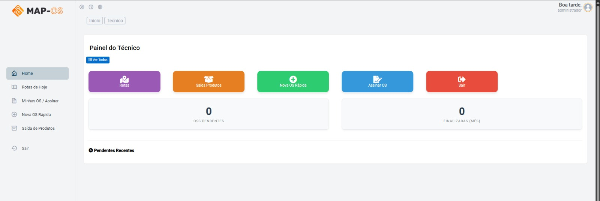
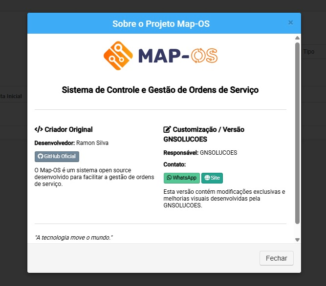
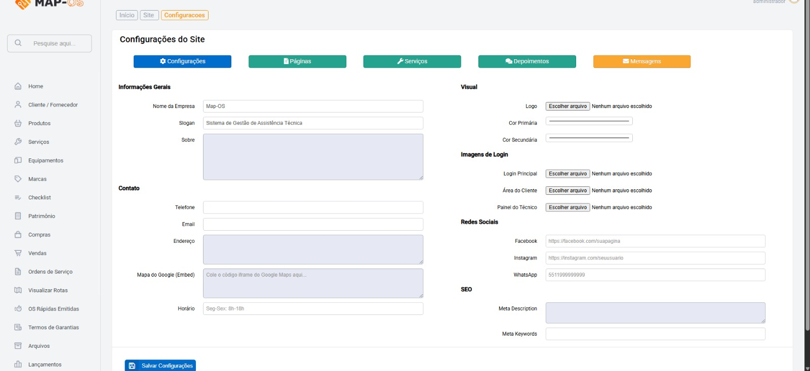
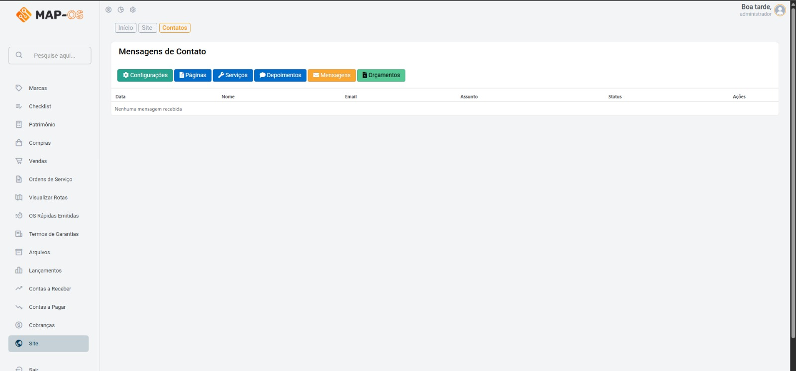

# Map-OS: ERP para Assistências e Comércios (Versão Premium)

Este software é uma versão fortemente modificada e turbinada do aclamado sistema Mapos. Embora o núcleo do sistema seja baseado em código livre, esta versão foi desenvolvida pela nossa equipe para atender necessidades que o original não cobre, transformando-o em um ERP completo para assistências e comércios.

### O que você recebe ao comprar esta versão:
Diferente da versão gratuita, aqui você leva um pacote de funcionalidades prontas para uso imediato:

- ✅ **Módulo de Equipamentos**: Controle detalhado do patrimônio e itens em manutenção.
- ✅ **PDV (Frente de Caixa)**: Venda rápida e integrada ao estoque.
- ✅ **Painel do Técnico**: Interface dedicada para sua equipe focar no serviço.
- ✅ **Site próprio com personalização**
- ✅ **Gestão de Compras**: Controle o que entra na empresa, não apenas o que sai.

#
## Telas do Sistema

  
    
  
    
  
    
  
    
  
    
  

### Atualização via sistema

1. Primeiro é necessário atualizar manualmente o sistema para a versão v4.4.0;
2. Quando estiver nessa versão é possível atualizar o sistema clicando no botão "Atualizar Mapos" em Sistema >> Configurações;
3. Serão baixados e atualizados todos os arquivos exceto: `config.php`, `database.php` e `email.php`;

### Frameworks/Bibliotecas
* [bcit-ci/CodeIgniter](https://github.com/bcit-ci/CodeIgniter)
* [twbs/bootstrap](https://github.com/twbs/bootstrap)
* [jquery/jquery](https://github.com/jquery/jquery)
* [jquery/jquery-ui](https://github.com/jquery/jquery-ui)
* [mpdf/mpdf](https://github.com/mpdf/mpdf)
* [Matrix Admin](http://wrappixel.com/demos/free-admin-templates/matrix-admin/index.html)
* [filp/whoops](https://github.com/filp/whoops)

### Requerimentos
* PHP >= 8.3
* MySQL >= 5.7 ou >= 8.0
* Composer >= 2
